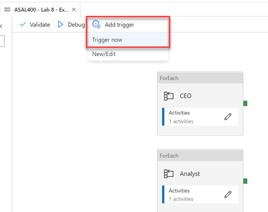
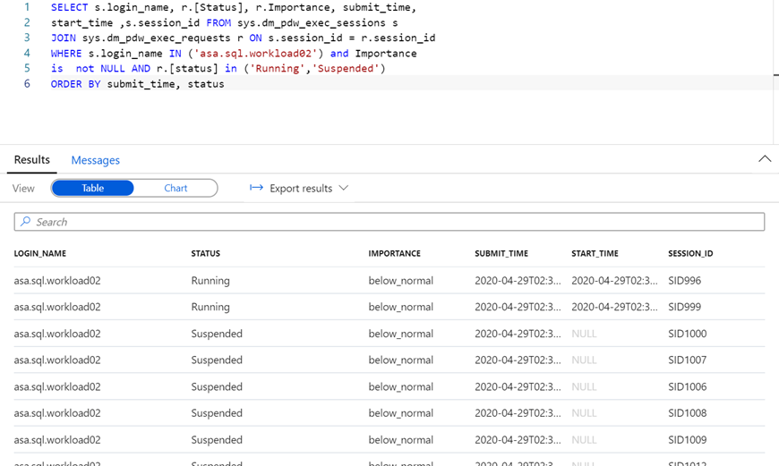
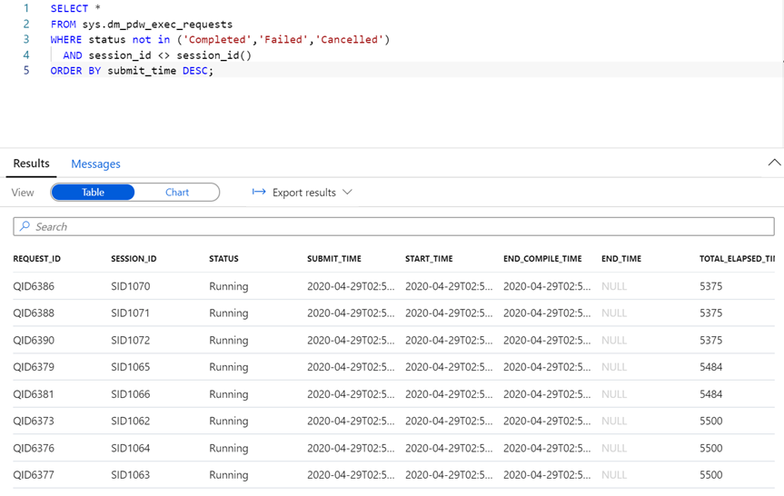
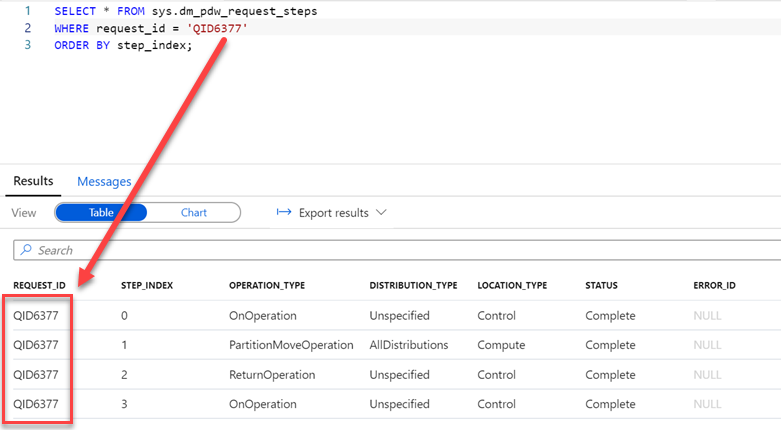
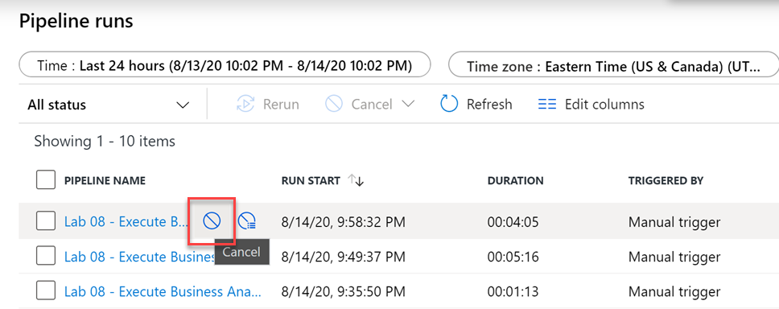
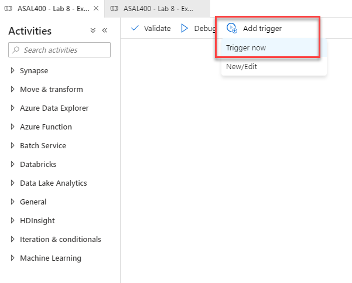
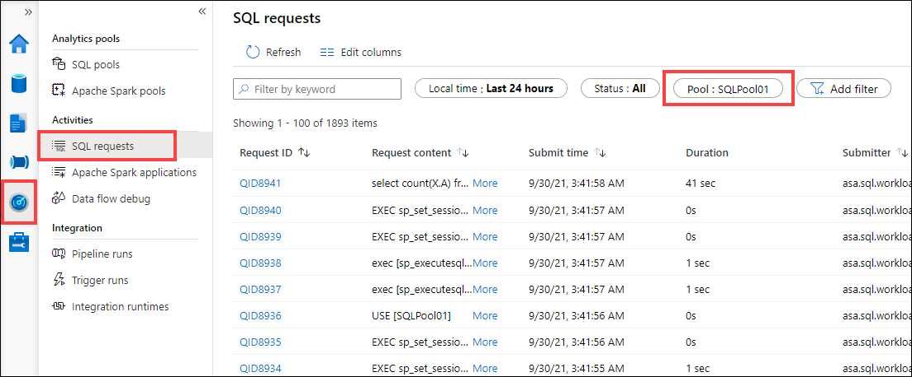

# Monitoring

Azure Synapse Analytics provides a rich monitoring experience within the Azure portal to surface insights regarding your data warehouse workload. The Azure portal is the recommended tool when monitoring your data warehouse as it provides configurable retention periods, alerts, recommendations, and customizable charts and dashboards for metrics and logs. The portal also enables you to integrate with other Azure monitoring services such as Azure Monitor (logs) with Log analytics to provide a holistic monitoring experience for not only your data warehouse but also your entire Azure analytics platform for an integrated monitoring experience.

You can monitor active SQL requests using the SQL requests area of the Monitor Hub. This includes details like the pool, submitter, duration, queued duration, workload group assigned, importance, and the request content.

Pipeline runs can be monitored using the Monitor Hub and selecting Pipeline runs. Here you can filter pipeline runs and drill in to view the activity runs associated with the pipeline run and monitor the running of in-progress pipelines.

The execution of Spark applications representing the execution of notebooks and jobs can be monitored within the Monitor Hub, selecting Spark applications. Selecting a Spark application to view its progress and to launch the Spark UI to examine a running Spark job and stage details, or the Spark history server to examine a completed application.

## Lab pre-requisite

Start the SQL Pool in your lab environment.

1. Open the Synapse Studio workspace and navigate to the **Manage** hub.

    

2. From the center menu, select **SQL pools** from beneath the **Analytics pools** heading. Locate `SQLPool01`, and select the **Resume** button.

    

## Exercise 1 - Workload Management

Running mixed workloads can pose resource challenges on busy systems. Solution Architects seek ways to separate classic data warehousing activities (such as loading, transforming, and querying data) to ensure that enough resources exist to hit SLAs.

Synapse SQL pool workload management in Azure Synapse consists of three high-level concepts: Workload Classification, Workload Importance and Workload Isolation. These capabilities give you more control over how your workload utilizes system resources.

Workload importance influences the order in which a request gets access to resources. On a busy system, a request with higher importance has first access to resources. Importance can also ensure ordered access to locks.

Workload isolation reserves resources for a workload group. Resources reserved in a workload group are held exclusively for that workload group to ensure execution. Workload groups also allow you to define the amount of resources that are assigned per request, much like resource classes do. Workload groups give you the ability to reserve or cap the amount of resources a set of requests can consume. Finally, workload groups are a mechanism to apply rules, such as query timeout, to requests.

### Task 1 - Workload Importance

Often in a data warehouse scenario you have users who need their queries to run quickly. The user could be executives of the company who need to run reports or the user could be an analyst running an adhoc query.

Setting importance in Synapse SQL for Azure Synapse allows you to influence the scheduling of queries. Queries with higher importance will be scheduled to run before queries with lower importance. To assign importance to queries, you need to create a workload classifier.

1. Open Synapse Analytics Studio (<https://web.azuresynapse.net/>), and then navigate to the **Develop** hub.

    

2. From the **Develop** menu, select the + button and choose **SQL Script** from the context menu.

    

3. In the toolbar menu, connect to the **SQL Pool** database to execute the query.

    

4. In the query window, replace the script with the following to confirm that there are no queries currently being run by users logged in as `asa.sql.workload01`, representing the CEO of the organization or `asa.sql.workload02` representing the data analyst working on the project:

    ```sql
    --First, let's confirm that there are no queries currently being run by users logged in workload01 or workload02

    SELECT s.login_name, r.[Status], r.Importance, submit_time, 
    start_time ,s.session_id FROM sys.dm_pdw_exec_sessions s 
    JOIN sys.dm_pdw_exec_requests r ON s.session_id = r.session_id
    WHERE s.login_name IN ('asa.sql.workload01','asa.sql.workload02') and Importance
    is not NULL AND r.[status] in ('Running','Suspended') 
    --and submit_time>dateadd(minute,-2,getdate())
    ORDER BY submit_time ,s.login_name
    ```

5. Select **Run** from the toolbar menu to execute the SQL command.

    

6. You will flood the system with queries and see what happens for `asa.sql.workload01` and `asa.sql.workload02`. To do this, we'll run a Azure Synapse Pipeline which triggers queries. Select the `Integrate` hub. **Run** the **Lab 08 - Execute Data Analyst and CEO Queries** Pipeline, which will run / trigger the `asa.sql.workload01` and `asa.sql.workload02` queries. You can run the pipeline with the Debug option if you have an instance of the Integration Runtime running. Otherwise, select **Add trigger**, then **Trigger now**. In the dialog that appears, select **OK**.

    

7. Navigate to the **Monitor** hub, select **Pipeline runs**, and view the status of the current pipeline run. **Let the Pipeline run for 30 seconds to one minute**, then select **Cancel recursive** for the Lab 08 pipeline.

    

8. Let's see what happened to all the queries we just triggered as they flood the system. Return to the query window, replace the script with the following:

    ```sql
    SELECT s.login_name, r.[Status], r.Importance, submit_time, start_time ,s.session_id FROM sys.dm_pdw_exec_sessions s 
    JOIN sys.dm_pdw_exec_requests r ON s.session_id = r.session_id
    WHERE s.login_name IN ('asa.sql.workload01','asa.sql.workload02') and Importance
    is not NULL AND r.[status] in ('Running','Suspended') and submit_time>dateadd(minute,-2,getdate())
    ORDER BY submit_time ,status
    ```

9. Select **Run** from the toolbar menu to execute the SQL command. You should see an output similar to the following:

    

10. We will give our `asa.sql.workload01` user queries priority by implementing the **Workload Importance** feature. Return to the query window, replace the script with the following:

    ```sql
    IF EXISTS (SELECT * FROM sys.workload_management_workload_classifiers WHERE name = 'CEO')
    BEGIN
        DROP WORKLOAD CLASSIFIER CEO;
    END
    CREATE WORKLOAD CLASSIFIER CEO
      WITH (WORKLOAD_GROUP = 'largerc'
      ,MEMBERNAME = 'asa.sql.workload01',IMPORTANCE = High);
    ```

11. Select **Run** from the toolbar menu to execute the SQL command.

12. Let's flood the system again with queries and see what happens this time for `asa.sql.workload01` and `asa.sql.workload02` queries. To do this, we'll run an Azure Synapse Pipeline which triggers queries. **Select** the `Integrate` hub, **run** the **Lab 08 - Execute Data Analyst and CEO Queries** Pipeline, which will run / trigger the `asa.sql.workload01` and `asa.sql.workload02` queries. **Please let this run for 30 seconds to one minute, then cancel recursively just as you have done before.**

13. In the query window, replace the script with the following to see what happens to the `asa.sql.workload01` queries this time:

    ```sql
    SELECT s.login_name, r.[Status], r.Importance, submit_time, start_time ,s.session_id FROM sys.dm_pdw_exec_sessions s 
    JOIN sys.dm_pdw_exec_requests r ON s.session_id = r.session_id
    WHERE s.login_name IN ('asa.sql.workload01','asa.sql.workload02') and Importance
    is not NULL AND r.[status] in ('Running','Suspended') and submit_time>dateadd(minute,-2,getdate())
    ORDER BY submit_time ,status desc
    ```

14. Select **Run** from the toolbar menu to execute the SQL command. You should see an output similar to the following that shows query executions for the `asa.sql.workload01` user having a **high** importance.

    

### Task 2 - Workload Isolation

Workload isolation means resources are reserved, exclusively, for a workload group. Workload groups are containers for a set of requests and are the basis for how workload management, including workload isolation, is configured on a system. A simple workload management configuration can manage data loads and user queries.

In the absence of workload isolation, requests operate in the shared pool of resources. Access to resources in the shared pool is not guaranteed and is assigned on an importance basis.

Configuring workload isolation should be done with caution as the resources are allocated to the workload group even if there are no active requests in the workload group. Over-configuring isolation can lead to diminished overall system utilization.

Users should avoid a workload management solution that configures 100% workload isolation: 100% isolation is achieved when the sum of `min_percentage_resource` configured across all workload groups equals 100%. This type of configuration is overly restrictive and rigid, leaving little room for resource requests that are accidentally misclassified. There is a provision to allow one request to execute from workload groups not configured for isolation.

1. Open Synapse Analytics Studio (<https://web.azuresynapse.net/>), and then navigate to the **Develop** hub.

    

2. From the **Develop** menu, select the + button and choose **SQL Script** from the context menu.

    

3. In the toolbar menu, connect to the **SQL Pool** database to execute the query.

    

4. In the query window, replace the script with the following:

    ```sql
    IF NOT EXISTS (SELECT * FROM sys.workload_management_workload_groups where name = 'CEODemo')
    BEGIN
        Create WORKLOAD GROUP CEODemo WITH  
        ( MIN_PERCENTAGE_RESOURCE = 50        -- integer value
        ,REQUEST_MIN_RESOURCE_GRANT_PERCENT = 25 --  
        ,CAP_PERCENTAGE_RESOURCE = 100
        )
    END
    ```

    The code creates a workload group called `CEODemo` to reserve resources exclusively for the workload group. In this example, a workload group with a `MIN_PERCENTAGE_RESOURCE` set to 50% and `REQUEST_MIN_RESOURCE_GRANT_PERCENT` set to 25% is guaranteed 2 concurrency.

5. Select **Run** from the toolbar menu to execute the SQL command.

    > **Please note:** If this query takes more than 30 seconds to execute, stop the query and run again. You might have to do this a few times, depending on how long it takes for the SQL queries executed by the pipeline to end.

6. In the query window, replace the script with the following to create a workload Classifier called `CEODreamDemo` that assigns a workload group and importance to incoming requests:

    ```sql
    IF NOT EXISTS (SELECT * FROM sys.workload_management_workload_classifiers where  name = 'CEODreamDemo')
    BEGIN
        Create Workload Classifier CEODreamDemo with
        ( Workload_Group ='CEODemo',MemberName='asa.sql.workload02',IMPORTANCE = BELOW_NORMAL);
    END
    ```

7. Select **Run** from the toolbar menu to execute the SQL command.

8. In the query window, replace the script with the following to confirm that there are no active queries being run by `asa.sql.workload02`:

    ```sql
    SELECT s.login_name, r.[Status], r.Importance, submit_time,
    start_time ,s.session_id FROM sys.dm_pdw_exec_sessions s
    JOIN sys.dm_pdw_exec_requests r ON s.session_id = r.session_id
    WHERE s.login_name IN ('asa.sql.workload02') and Importance
    is not NULL AND r.[status] in ('Running','Suspended')
    ORDER BY submit_time, status
    ```

    > **Note**: There still may be queries left over from previous activities. You can choose to wait for them to complete, or access the SQL requests in the **Manage Hub** and cancel each session manually. Queries that are queued after the creation of the workload group and workload classifier will automatically have this workload management assigned to them.

9. Let's flood the system with queries and see what happens for `asa.sql.workload02`. To do this, we will run an Azure Synapse Pipeline which triggers queries. Select the `Integrate` hub. **Run** the **Lab 08 - Execute Business Analyst Queries** Pipeline, which will run / trigger  `asa.sql.workload02` queries. Ple**ase let this pipeline run for 30 seconds to one minute, then cancel it recursively**.

10. In the query window, replace the script with the following to see what happened to all the `asa.sql.workload02` queries we just triggered as they flood the system:

    ```sql
    SELECT s.login_name, r.[Status], r.Importance, submit_time,
    start_time ,s.session_id FROM sys.dm_pdw_exec_sessions s
    JOIN sys.dm_pdw_exec_requests r ON s.session_id = r.session_id
    WHERE s.login_name IN ('asa.sql.workload02') and Importance
    is not NULL AND r.[status] in ('Running','Suspended')
    ORDER BY submit_time, status
    ```

11. Select **Run** from the toolbar menu to execute the SQL command. You should see an output similar to the following that shows the importance for each session set to `below_normal`:

    

12. In the query window, replace the script with the following to set 3.25% minimum resources per request:

    ```sql
    IF  EXISTS (SELECT * FROM sys.workload_management_workload_classifiers where group_name = 'CEODemo')
    BEGIN
        Drop Workload Classifier CEODreamDemo
        DROP WORKLOAD GROUP CEODemo
        --- Creates a workload group 'CEODemo'.
            Create  WORKLOAD GROUP CEODemo WITH  
        (MIN_PERCENTAGE_RESOURCE = 26 -- integer value
            ,REQUEST_MIN_RESOURCE_GRANT_PERCENT = 3.25 -- factor of 26 (guaranteed more than 4 concurrencies)
        ,CAP_PERCENTAGE_RESOURCE = 100
        )
        --- Creates a workload Classifier 'CEODreamDemo'.
        Create Workload Classifier CEODreamDemo with
        (Workload_Group ='CEODemo',MemberName='asa.sql.workload02',IMPORTANCE = BELOW_NORMAL);
    END
    ```

    > **Note**: Configuring workload containment implicitly defines a maximum level of concurrency. With a CAP_PERCENTAGE_RESOURCE set to 60% and a REQUEST_MIN_RESOURCE_GRANT_PERCENT set to 1%, up to a 60-concurrency level is allowed for the workload group. Consider the method included below for determining the maximum concurrency:
    >
    > [Max Concurrency] = [CAP_PERCENTAGE_RESOURCE] / [REQUEST_MIN_RESOURCE_GRANT_PERCENT]

13. Let's flood the system again and see what happens for `asa.sql.workload02`. To do this, we will run an Azure Synapse Pipeline which triggers queries. Select the `Integrate` hub. **Run** the **Lab 08 - Execute Business Analyst Queries** Pipeline, which will run / trigger  `asa.sql.workload02` queries. **Please let this run for 30 seconds to one minute, then cancel it recursively**.

14. In the query window, replace the script with the following to see what happened to all of the `asa.sql.workload02` queries we just triggered as they flood the system:

    ```sql
    SELECT s.login_name, r.[Status], r.Importance, submit_time,
    start_time ,s.session_id FROM sys.dm_pdw_exec_sessions s
    JOIN sys.dm_pdw_exec_requests r ON s.session_id = r.session_id
    WHERE s.login_name IN ('asa.sql.workload02') and Importance
    is  not NULL AND r.[status] in ('Running','Suspended')
    ORDER BY submit_time, status
    ```

15. Select **Run** from the toolbar menu to execute the SQL command.

## Exercise 2 - Workload Monitoring

Azure Synapse Analytics provides a rich monitoring experience within the Azure portal to surface insights regarding your data warehouse workload. The Azure portal is the recommended tool when monitoring your data warehouse as it provides configurable retention periods, alerts, recommendations, and customizable charts and dashboards for metrics and logs. The portal also enables you to integrate with other Azure monitoring services such as Azure Monitor (logs) with Log analytics to provide a holistic monitoring experience for not only your data warehouse but also your entire Azure analytics platform for an integrated monitoring experience.

For a programmatic experience when monitoring SQL Analytics via T-SQL, the service provides a set of Dynamic Management Views (DMVs). These views are useful when actively troubleshooting and identifying performance bottlenecks with your workload.

### Task 1 - Monitoring with Dynamic Management Views

All logins to your data warehouse are logged to `sys.dm_pdw_exec_sessions`. This DMV contains the last 10,000 logins. The `session_id` is the primary key and is assigned sequentially for each new logon.

1. Open Synapse Analytics Studio (<https://web.azuresynapse.net/>), and then navigate to the **Develop** hub.

    

2. From the **Develop** menu, select the + button and choose **SQL Script** from the context menu.

    

3. In the toolbar menu, connect to the **SQL Pool** database to execute the query.

    

4. In the query window, replace the script with the following:

    ```sql
    SELECT * FROM sys.dm_pdw_exec_sessions where status <> 'Closed' and session_id <> session_id();
    ```

    All queries executed on SQL pool are logged to `sys.dm_pdw_exec_requests`. This DMV contains the last 10,000 queries executed. The `request_id` uniquely identifies each query and is the primary key for this DMV. The `request_id` is assigned sequentially for each new query and is prefixed with `QID`, which stands for query ID. Querying this DMV for a given `session_id` shows all queries for a given logon.

5. Select **Run** from the toolbar menu to execute the SQL command.

6. Let's flood the system with queries to create operations to monitor. To do this, we will run a Azure Synapse Pipeline which triggers queries. Select the `Integrate` hub. **Run** the **Lab 08 - Execute Business Analyst Queries** Pipeline, which will run / trigger  `asa.sql.workload02` queries. **Please let this pipeline run for 30 seconds to one minute, then cancel it recursively**.

7. In the query window, replace the script with the following:

    ```sql
    SELECT *
    FROM sys.dm_pdw_exec_requests
    WHERE status not in ('Completed','Failed','Cancelled')
      AND session_id <> session_id()
    ORDER BY submit_time DESC;
    ```

8. Select **Run** from the toolbar menu to execute the SQL command. You should see a list of sessions in the query results similar to the following. **Note the `Request_ID` of a query** in the results that you would like to investigate (*keep this value in a text editor for a later step*):

    

9. As an alternative, you can execute the following SQL command to find the top 10 longest running queries.

    ```sql
    SELECT TOP 10 *
    FROM sys.dm_pdw_exec_requests
    ORDER BY total_elapsed_time DESC;
    ```

10. To simplify the lookup of a query in the `sys.dm_pdw_exec_requests` table, use `LABEL` to assign a comment to your query, which can be looked up in the `sys.dm_pdw_exec_requests` view. To test using the labels, replace the script in the query window with the following:

    ```sql
    SELECT *
    FROM sys.tables
    OPTION (LABEL = 'My Query');
    ```

11. Select **Run** from the toolbar menu to execute the SQL command.

12. In the query window, replace the script with the following to filter the results with the label, `My Query`.

    ```sql
    -- Find a query with the Label 'My Query'
    -- Use brackets when querying the label column, as it it a key word
    SELECT  *
    FROM sys.dm_pdw_exec_requests
    WHERE [label] = 'My Query';
    ```

13. Select **Run** from the toolbar menu to execute the SQL command. You should see the previously run query in the results view.

14. In the query window, replace the script with the following to retrieve the query's distributed SQL (DSQL) plan from `sys.dm_pdw_request_steps`. **Be sure to replace** the `QID#####` with the `Request_ID` you noted in Step 12:

    ```sql
    SELECT * FROM sys.dm_pdw_request_steps
    WHERE request_id = 'QID####'
    ORDER BY step_index;
    ```

15. Select **Run** from the toolbar menu to execute the SQL command. You should see results showing the distributed query plan steps for the specified request:

    

    > When a DSQL plan is taking longer than expected, the cause can be a complex plan with many DSQL steps or just one step taking a long time. If the plan is many steps with several move operations, consider optimizing your table distributions to reduce data movement.

### Task 2 - Orchestration Monitoring with the Monitor Hub

1. Let's run a pipeline to monitor its execution in the next step. To do this, select the `Integrate` hub. **Run** the **Lab 08 - Execute Business Analyst Queries** Pipeline.

    

2. Navigate to the `Monitor` hub. Then select **Pipeline runs** to get a list of pipelines that ran during the last 24 hours. Observe the Pipeline status.

    

3. Hover over the running pipeline and select **Cancel** to cancel the execution of the current instance of the pipeline.

    

### Task 3 - Monitoring SQL Requests with the Monitor Hub

1. Let's run a pipeline to monitor its execution in the next step. To do this, select the `Integrate` hub. **Run** the **Lab 08 - Execute Business Analyst Queries** Pipeline. **Let this pipeline run for 30 seconds to one minute, then cancel it recursively**.

    

2. Navigate to the `Monitor` hub. Then select **SQL requests** to get a list of SQL requests that ran during the last 24 hours.

3. Select the **Pool** filter and select your SQL Pool. Observe the `Request Submitter`, `Submit Time`, `Duration`, and `Queued Duration` values.

    

4. Select **More** on a request to access the actual T-SQL command executed as part of the SQL Request.

    

## Cleanup: Pause the dedicated SQL pool

1. Navigate to the **Manage** hub.

    

2. From the center menu, select **SQL pools** from beneath the **Analytics pools** heading. Locate `SQLPool01`, and select the **Pause** button.

    

3. When prompted, select **Pause**.

## Resources

- [Workload Group Isolation](https://docs.microsoft.com/azure/synapse-analytics/sql-data-warehouse/sql-data-warehouse-workload-isolation)
- [Workload Isolation](https://docs.microsoft.com/azure/synapse-analytics/sql-data-warehouse/sql-data-warehouse-workload-isolation)
- [Workload Importance](https://docs.microsoft.com/azure/synapse-analytics/sql-data-warehouse/sql-data-warehouse-workload-importance)
- [Workload Classification](https://docs.microsoft.com/azure/synapse-analytics/sql-data-warehouse/sql-data-warehouse-workload-classification)
- [Monitoring workload using DMVs](https://docs.microsoft.com/azure/synapse-analytics/sql-data-warehouse/sql-data-warehouse-manage-monitor)
